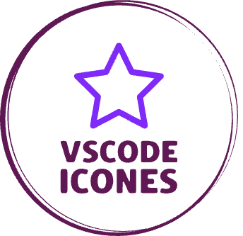
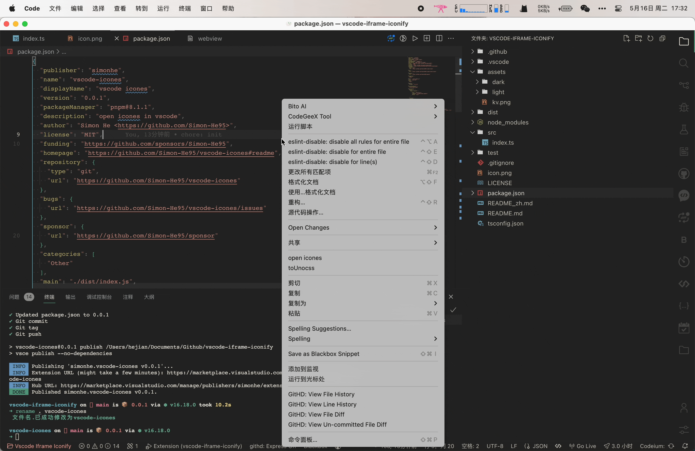

 English | <a href="./README_zh.md">简体中文</a>

vscode extension: Open icons in vscode, no need to go to the browser to find icons

🌈 Support copying in vscode～

## :coffee:

[buy me a cup of coffee](https://github.com/Simon-He95/sponsor)

## License

[MIT](./license)
